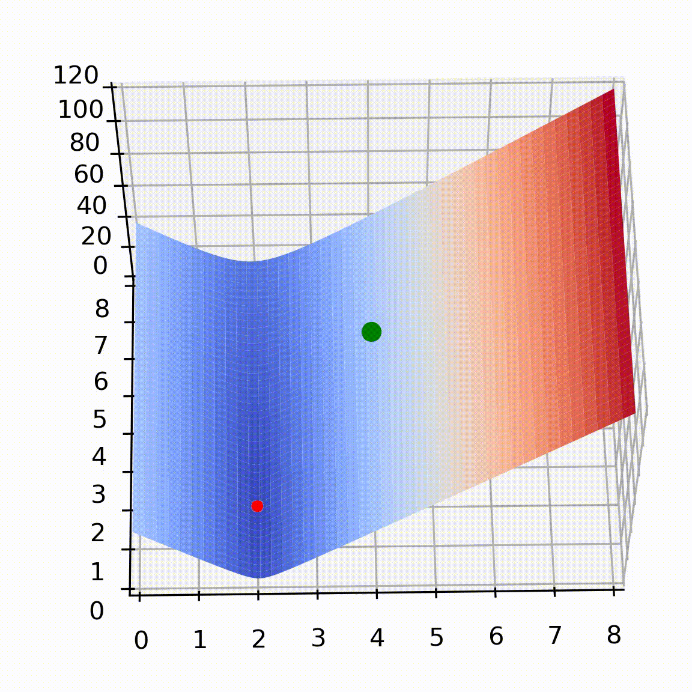

# ML_coban
Thú thật thì cái project này chả có ai đọc cả, nhưng thực tế thì những gì tôi làm cũng chỉ là cho bản thân, vì tôi nhận ra là khi tôi cố gắng dạy cho ai đó thì bản thân tôi cũng hiểu về chủ đề rõ hơn nhiều.\
Project này chứa tài liệu dạy về gốc rễ của Machine Learning, về đạo hàm, gradient descent cho hàm 1, 2, nhiều biến, và giải thích ý tưởng của nó.\
Group fb chứa các bài đăng: https://www.facebook.com/groups/885247975151749/ \

\
Gif: Gradient descent cho hàm hai biến\
\[Thư mục code:\]\
Code cơ bản để hiểu gốc rễ của Machine Learning\
Vào thư mục Colab để chạy file live interaction Machine Learning.\
Thư mục Gradient Descent là tạo ảnh visualize đạo hàm.\
